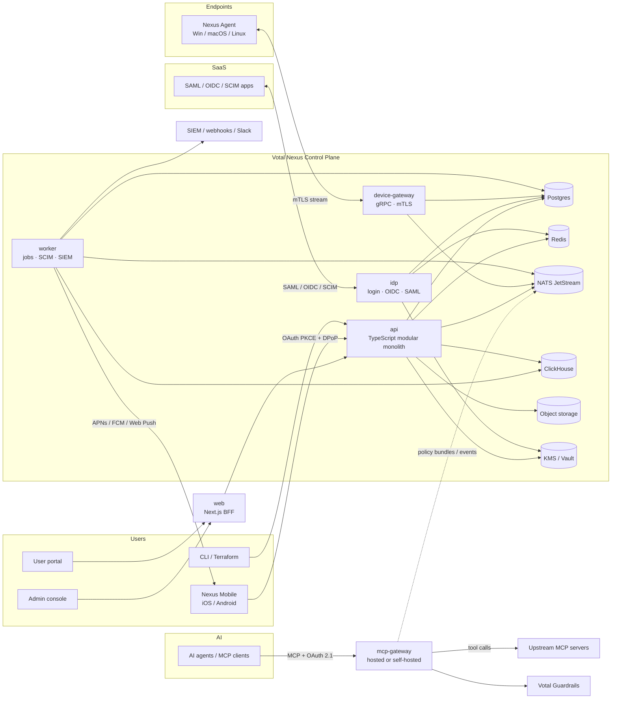
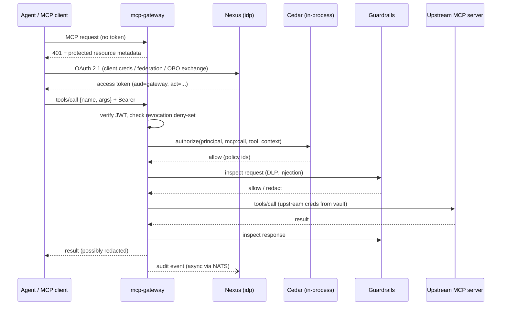
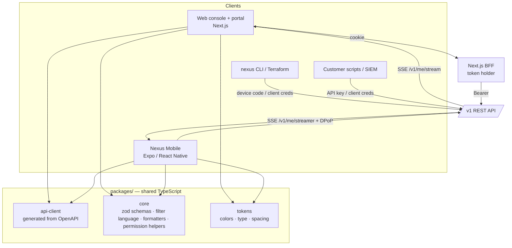
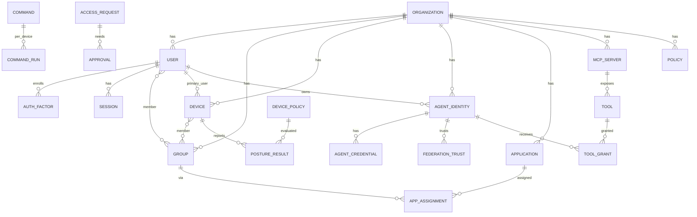

# Votal Nexus — Technical Architecture

| | |
|---|---|
| **Status** | Draft v0.2 |
| **Date** | 2026-09-24 |
| **Related** | [SPEC.md](SPEC.md) · [UI.md](UI.md) · [ROADMAP.md](ROADMAP.md) |

---

## 1. Principles

1. **Modular monolith first.** One TypeScript control-plane codebase with strict module boundaries. Only the components with different scaling or trust profiles become separate deployables: the device gateway, MCP gateway and workers.
2. **One API, many clients.** The web console, mobile app, CLI, Terraform and customers' own scripts all call the **same public `/v1` REST API** with OAuth tokens. There are no client-specific backends. A capability that exists in one client exists for all (see §10).
3. **One policy engine** (Cedar) for admin RBAC, conditional access and MCP tool authorization.
4. **Every mutation emits an event** through a transactional outbox, so the audit log is complete by construction.
5. **Zero static secrets for machines.** Devices use X.509 certificates, and agents and services use federated or short-lived tokens.
6. **Tenant isolation in depth.** Tenancy is enforced with Postgres RLS, tenant-scoped keys and tenant-scoped caches, not only with application code.
7. **Boring, proven infrastructure.** Postgres, Redis, NATS, ClickHouse, S3 and Kubernetes.

## 2. System context



## 3. Deployables

| Deployable | Language | Responsibility | Scaling |
|---|---|---|---|
| `web` | TypeScript (Next.js) | Admin console + user portal. A thin **token-holding BFF** (§10.2) proxies to the `/v1` API; it holds no business logic. | Stateless, horizontal |
| `mobile` | TypeScript (Expo / React Native) | Nexus Mobile: authenticator + responder app (SPEC §5.23). Calls `/v1` directly. | App stores |
| `api` | TypeScript (Node, Hono) | REST API for all modules; runs the `idp` role (login, OIDC, SAML, SCIM server) behind a flag | Stateless, horizontal |
| `device-gateway` | TypeScript (Node) | Terminates agent mTLS streams, relays heartbeats, inventory and command results; fans commands out from NATS | Connection-heavy; sharded by device ID |
| `mcp-gateway` | TypeScript (Node) | MCP reverse proxy: authN, Cedar authZ, guardrails, rate limits, tracing. Works hosted or self-hosted. | Stateless data plane; latency-critical |
| `worker` | TypeScript (Node) | Background jobs: SCIM push, SIEM export, **notification delivery** (push, email, Slack, web push), dynamic group evaluation, report generation, and CH ingestion from NATS | Queue-driven |
| `agent` | **Go** (the one non-TS component) | Endpoint agent (service + tray UI). Embeds **osquery** for inventory and posture. | One per device |

All server components are TypeScript packages in one pnpm workspace (`apps/*`), sharing `packages/*`. The endpoint agent stays a compiled Go binary (ADR-013): it runs on every employee laptop and needs a tiny footprint with no runtime.

## 4. Tech stack

| Layer | Choice | Why |
|---|---|---|
| Backend language | **TypeScript on Node 22+** (Go for the endpoint agent only) | One language across API, web and mobile; zod schemas shared end-to-end; the MCP ecosystem is TS-first |
| HTTP / API | **Hono** + `@hono/zod-openapi`: routes declare zod schemas, the OpenAPI 3.1 doc is generated from them | One definition gives validation, types and the public contract; `openapi-typescript` generates the client for web and mobile |
| Agent RPC | **gRPC** bidi streams (protobuf, `buf`) | Efficient long-lived device connections |
| OIDC provider | Focused in-house OP on `jose` (code flow + PKCE, discovery, JWKS, userinfo), verified in CI against `openid-client`, a certified RP | Per-tenant issuers and our session/MFA/RLS model don't fit a one-issuer-per-instance library; the certified RP keeps us honest (see ADR-014) |
| SAML IdP | `samlify` | Maintained Node SAML IdP/SP |
| Passwords / WebAuthn / TOTP | `@node-rs/argon2` (Argon2id), `@simplewebauthn/server`, `otpauth` | Standard, maintained |
| Policy engine | **Cedar** (`@cedar-policy/cedar-wasm`) | Analyzable, fast, readable policies with schema validation; fits principal/action/resource |
| Primary DB | **PostgreSQL 16** + RLS; **Kysely** for typed queries; plain SQL migrations (`apps/api/migrations`) | Relational integrity; type-safe SQL without an ORM; RLS policies and functions stay reviewable SQL |
| Job queue | **graphile-worker** (Postgres-backed) | Transactional enqueue alongside the outbox; no extra infrastructure |
| Event bus | **NATS JetStream** | Command fan-out to devices, policy bundle push to gateways, event streaming |
| Cache / rate limit | **Redis 7** (Valkey-compatible) | Sessions, rate limiting, revocation lists |
| Analytics / audit store | **ClickHouse** | Fast filtered search over billions of events; TTL-based retention |
| Object storage | S3 (or compatible) | Agent binaries, scripts, exports, reports |
| Secrets / keys | Cloud KMS (envelope encryption) + per-tenant DEKs; HSM-backed signing keys | Tenant-scoped crypto isolation |
| Mobile | **Expo (React Native) + TypeScript**, Expo Router, NativeWind (shares Tailwind tokens), TanStack Query, `react-native-passkeys`, native modules for Secure Enclave / StrongBox keys | ~60% code sharing with web (API client, schemas, logic, tokens); one team; OTA updates for non-native fixes |
| Frontend | **Next.js 15 (App Router) + React 19 + TypeScript**, Tailwind CSS v4, **shadcn/ui** (Radix), TanStack Query + Table, react-hook-form + zod, cmdk, Monaco, React Flow, Recharts | See [UI.md](UI.md) |
| Agent inventory | **osquery** (embedded, managed by the agent) | Hundreds of cross-platform tables for free |
| Infrastructure | Kubernetes (EKS), Helm, Terraform, Argo CD | Standard; the self-hosted gateway reuses the Helm charts |
| Observability | OpenTelemetry → Grafana stack (Tempo, Loki, Mimir) or Datadog | Vendor-neutral |
| Local dev | `docker compose` for dependencies + `Tilt` for services; seeded demo tenant | One command up |

## 5. Module boundaries (inside `api`)

```
apps/api/src/
  platform/     # tenancy, db (RLS session), outbox, config, crypto, errors, pagination
  directory/    # users, groups, dynamic groups, custom attributes, import
  authn/        # passwords, MFA factors, WebAuthn, sessions, risk signals
  idp/          # OIDC OP, SAML IdP, app catalog, claim mapping, cert rotation
  provisioning/ # SCIM server (inbound), SCIM client (outbound), connectors
  rbac/         # admin roles, permission catalog, scoped roles
  policy/       # Cedar schema, policy store, evaluator, what-if simulator, bundles
  access/       # conditional access, access requests/JIT, reviews
  devices/      # enrollment, device CA, inventory, posture, device policies
  commands/     # scripts, command queue, signing, results
  agents/       # agent identities, credentials, federation, token exchange, kill switch
  mcp/          # MCP server registry, tool catalog, drift, gateway config
  audit/        # event schema, query API, SIEM destinations, alert rules
  notify/       # notification rules, recipients, preferences, inbox, channels, delivery log, push registrations
  integrations/ # webhooks, Slack/Teams apps, PagerDuty/Opsgenie, SIEM destinations
  billing/
```

Rules:
- A module exposes its service functions and domain types. Other modules may import **only** those, never another module's queries or route handlers. This is enforced with `dependency-cruiser` rules in CI.
- Cross-module side effects travel as **domain events** through the outbox (e.g. `directory.user.deprovisioned` → `provisioning`, `devices`, `agents` react).

## 6. Policy engine

Cedar is used in three places with one schema:

| Use | Principal | Action | Resource | Context |
|---|---|---|---|---|
| Admin RBAC | `User` (admin) | `Action::"users:update"` … | `User`, `Device`, `Group`… | role scope, MFA age |
| Conditional access | `User` | `Action::"sso:login"` | `Application` | device {managed, compliant, os}, ip, geo, risk, time |
| MCP tool authz | `Agent` / `User` / `Delegation` | `Action::"mcp:call"` | `Tool` (in `McpServer`) | args, device posture of the user, delegation chain, data class |

Example MCP policy:

```cedar
// Coding agents may open PRs only in the org's repos, on behalf of engineers on compliant devices.
permit (
  principal is Agent,
  action == Action::"mcp:call",
  resource == Tool::"github.create_pull_request"
)
when {
  principal.tags.contains("coding") &&
  context.onBehalfOf in Group::"engineering" &&
  context.device.compliant &&
  context.args.repo like "votal-ai/*"
};

forbid (principal, action == Action::"mcp:call", resource)
when { resource.risk == "destructive" && !context.humanApproved };
```

- **Authoring:** a visual builder (for common cases) generates Cedar, and an advanced mode uses Monaco with schema-aware autocomplete. Policies are validated against the schema on save.
- **Distribution:** policies plus entity snapshots are compiled into signed **policy bundles** (per tenant, versioned) and pushed via NATS to gateways, which also poll as a fallback. Gateways evaluate locally, and entity data (groups, device posture) is cached with a TTL and invalidated on change.
- **Decisions** are logged with the policy IDs that matched (for explainability and the what-if simulator).

## 7. Identity and token design

### 7.1 Keys
- A per-tenant signing key (ES256) for OIDC ID and access tokens, rotated every 90 days with a 2-key overlap; JWKS published at `/.well-known/jwks.json` on the tenant domain.
- A per-tenant SAML signing certificate (RSA-2048/3072, as required by SPs) with managed rotation.
- A per-tenant **Device CA** (ECDSA P-256) whose intermediate is signed by the Votal root held in an HSM. Device certs last 30 days and auto-renew at 2/3 of their lifetime.
- The command-signing key is per tenant (Ed25519); the agent pins the tenant's public key at enrollment.

### 7.2 Tenant URLs
`https://{org}.nexus.votal.ai` (with a custom domain option) for the login page, OIDC issuer, SAML entity ID and portal. The API lives at `https://api.nexus.votal.ai/v1` with a tenant derived from the credential.

### 7.3 Agent identity tokens
- Principal ID: `nexus://{tenant}/agent/{agentId}` (a SPIFFE-style URI in the `sub` claim).
- **Credential flows:**
  - `client_credentials` with `private_key_jwt` (preferred) or a client secret (discouraged; expires ≤ 90 days)
  - **Workload identity federation:** the agent presents an external OIDC token (GitHub Actions, K8s SA, AWS STS, GCP) and Nexus validates it against a configured trust (issuer + subject pattern) before issuing a Nexus token. No stored secrets.
- **On-behalf-of** (RFC 8693): `subject_token` = user token, `actor_token` = agent token. The result is a token with `sub=user`, `act={sub: agent}`, and scopes = intersection(agent grants, user entitlements, requested). Nested `act` claims form the delegation chain.
- Access tokens last 15 min by default and are audience-bound (`aud` = MCP gateway / resource). There are no refresh tokens for agents; they re-mint.
- **Revocation / kill switch:** the revocation record is written to Postgres, broadcast via NATS `revocations.{tenant}`, and held in the gateway's in-memory deny-set, so it takes effect in < 5 s. A token's `jti` plus the agent's `rev` counter allow bulk invalidation.

### 7.4 Human sessions

> **Implemented today (walking skeleton):** opaque session tokens (`nxs_…`, SHA-256 hashed at rest) issued by `/v1/auth/login` and `/v1/signup`, revocable per session, with a `pending_mfa → active` state. The web BFF keeps the token in an HttpOnly cookie. The OIDC/OAuth layer below arrives with SSO in A2 and issues tokens on top of the same session model.

- Every client gets **OAuth access tokens** from the Nexus IdP (Nexus is a client of itself). The `/v1` API is a pure resource server; it never reads cookies.
- **Web:** the Next.js BFF is a confidential OIDC client. It holds tokens server-side, and the browser only has an HttpOnly, Secure, SameSite=Lax session cookie plus a CSRF token (see §10.2).
- **Mobile:** a public client using auth code + PKCE, with refresh-token rotation, **DPoP-bound** to a hardware key (see §10.3).
- An IdP session (for SSO across apps) is an opaque ID in Redis with a Postgres fallback; idle and absolute timeouts come from org policy.
- **Step-up:** sensitive actions require `acr=mfa` with `auth_time` ≤ 5 min. The API returns `401` with `WWW-Authenticate: ... error="insufficient_user_authentication"` (RFC 9470), and every client handles that one response the same way.

## 8. Device agent

```
┌───────────────────────── Nexus Agent (system service) ─────────────────────────┐
│ enrollment · cert mgmt (TPM / Secure Enclave / DPAPI fallback)                 │
│ connection mgr ── gRPC bidi stream (mTLS) ── device-gateway                    │
│ osqueryd (managed child) → inventory & posture collectors                      │
│ policy engine (desired state → check → remediate → report)                     │
│ command runner (verify Ed25519 signature → sandboxed exec → stream output)     │
│ updater (signed manifests, staged rings, rollback)                             │
│ local API (loopback, mTLS) ← browser device-trust handshake, tray app          │
└────────────────────────────────────────────────────────────────────────────────┘
Tray app (per user session): status, compliance fixes, push-MFA prompts, notifications
```

- **Protocol:** after connecting, the agent sends `Hello{agentVersion, osInfo, certSerial}`. The gateway streams `Command`, `PolicyBundle` and `QueryRequest`. The agent streams `Heartbeat`, `InventoryDelta`, `PostureReport`, `CommandOutput` and `Event`.
- **Inventory** is sent as **deltas** (hash per osquery table snapshot) to keep bandwidth small.
- **Offline behavior:** the agent keeps enforcing the last-known policies, buffers events (bounded ring, 10 MB), and replays them on reconnect.
- **Build and supply chain:** reproducible builds, Apple notarization, Windows Authenticode (EV), Linux packages signed with GPG, SBOM (CycloneDX) and SLSA provenance attached to every release.

## 9. MCP Gateway



- **Transports:** streamable HTTP (primary) and SSE (legacy); stdio servers run as sidecars wrapped by `mcp-bridge`.
- **Virtual servers:** one gateway endpoint (`/mcp/{virtualServer}`) aggregates tools from multiple upstreams, with name prefixing and filtering by the caller's permissions, so `tools/list` returns only the tools the caller may call.
- **Tool drift:** a hash of each tool's name, description and input schema is stored. A changed hash puts the tool into `pending_review`, and it stays blocked until an admin approves it (defeats rug-pull and tool poisoning).
- **Self-hosted mode:** the gateway authenticates to the control plane with an mTLS gateway identity, pulls policy bundles, and pushes redacted events. It keeps working on its cached bundle if the control plane is unreachable (configurable fail-open or fail-closed).

## 10. Client architecture: one API for web, mobile and CLI

### 10.1 Rules

1. **The `/v1` OpenAPI spec is the contract.** Web, mobile, CLI, the Terraform provider and customer integrations all use it. There are **no mobile-only or web-only endpoints**. If mobile needs a leaner view, the fix is a general-purpose API feature (`fields`, `expand`, a `/me/*` aggregate) that every client can use.
2. **Authorization lives only on the server.** Cedar checks every call. Clients hide actions the user can't take, using `GET /v1/me/permissions`, but that is cosmetic.
3. **Generated clients, shared logic.** `packages/api-client` is generated from OpenAPI into a typed `fetch` client plus TanStack Query hooks. It runs unchanged in Next.js and React Native.
4. **Additive evolution.** Old mobile app versions live for months, so fields are never removed or repurposed within `/v1`. `MOB-10` min-version enforcement covers security fixes.



### 10.2 Web (BFF pattern)
- The Next.js server performs the OIDC login and stores access and refresh tokens in an encrypted server-side session. The browser never sees a token.
- Server components call `/v1` with the user's token for the first render. Client components call `/api/v1/*` on the BFF, which attaches the token and streams the response through untouched (a transparent proxy, not a second API).
- Real-time updates use `EventSource` on `/api/v1/me/stream`, which the BFF proxies to the API's SSE endpoint.

### 10.3 Mobile
- **Login:** auth code + PKCE through `ASWebAuthenticationSession` / Chrome Custom Tabs, so passkeys and corporate SSO work unchanged.
- **Tokens:** access token 10 min; refresh token rotated on every use and **bound with DPoP** to a non-exportable key in the Secure Enclave / StrongBox. A stolen refresh token is useless on another device.
- **Authenticator enrollment:** the app generates a second hardware key (`userPresence` / biometric-gated) and registers its public key as a `push` auth factor. A push-MFA approval is a signature over `{challengeId, numberShown, nonce}` with that key, and the server verifies it. It works like WebAuthn, but over push.
- **Data:** minimal cache (TanStack Query persisted to an encrypted MMKV store), wiped on logout or remote sign-out. Sensitive screens use `FLAG_SECURE` and iOS screen-capture protection.
- **Updates:** native code ships through the stores; JS-only fixes ship through Expo EAS Update (signed), subject to min-version policy.

### 10.4 API features that make multi-client easy
| Feature | Purpose |
|---|---|
| `GET /v1/me`, `/v1/me/permissions`, `/v1/me/notifications`, `/v1/me/approvals`, `/v1/me/devices`, `/v1/me/apps`, `/v1/me/agents` | Everything a signed-in human needs, the same for portal, mobile and admin |
| `?fields=` sparse fieldsets, `?expand=` | Small payloads on mobile, rich ones on web, one endpoint |
| Action sub-resources: `POST /v1/users/{id}/contain`, `/v1/agents/{id}/kill`, `/v1/approvals/{id}/approve` | Explicit, auditable, idempotent actions identical across clients |
| `ETag` + `If-None-Match` | Cheap revalidation on flaky mobile networks |
| `GET /v1/me/stream` (SSE) | One real-time channel: inbox items, approval prompts, entity changes the client is viewing |
| `Nexus-Client: ios/1.4.2` header | Telemetry and min-version enforcement (`426 Upgrade Required`) |

## 11. Notifications architecture

```mermaid
flowchart LR
  EV[Domain events<br/>outbox → NATS] --> RE[Rule engine<br/>built-in + admin rules]
  RE --> RR[Recipient resolver<br/>roles · owners · approvers · on-call]
  RR --> PF[Preferences + policy<br/>category × channel · quiet hours · forced critical]
  PF --> DD[Dedup / group / rate cap]
  DD --> IN[(Inbox<br/>Postgres notifications)]
  IN --> SSE[SSE fan-out<br/>NATS me.{userId}]
  DD --> Q[graphile-worker delivery jobs]
  Q --> APNS[APNs]
  Q --> FCM[FCM]
  Q --> WP[Web Push VAPID]
  Q --> EM[Email]
  Q --> SL[Slack / Teams]
  Q --> PD[PagerDuty / Opsgenie]
  Q --> DL[(Delivery log)]
```

- **The inbox is the source of truth.** Every notification is first written to `notifications` (Postgres, RLS). Channels only *deliver a pointer to it*. Web and mobile render the same record, so reading or acting on one device clears it everywhere (a `notification.updated` SSE event).
- **Content-free push:** APNs, FCM and Web Push payloads contain `{notificationId, category, generic title}` only, e.g. "New sign-in approval". The app fetches details over the authenticated API. No security data sits in Apple or Google infrastructure or on a lock screen. We send **directly** to APNs and FCM (no third-party push relay).
- **Push MFA path (latency-critical):** the sign-in creates an `mfa_challenge` and publishes to NATS. A dedicated high-priority delivery lane sends the APNs/FCM push (priority 10 / high) **and** the SSE event (if the app is open) in parallel. The target is end-to-end < 3 s p95.
- **Actionable notifications:** action buttons (Approve, Deny, Contain, Acknowledge) never carry a bearer token. They open the app or console, which calls the action endpoint with the user's own token plus step-up if required. Slack actions map the Slack user to a Nexus user and require a Nexus confirmation for high-risk actions.
- **Push registrations:** `POST /v1/me/push-registrations {platform: ios|android|web, token|subscription, deviceName}`. Registrations are tied to the session and removed on logout or sign-out-everywhere; invalid tokens reported by APNs/FCM are pruned automatically.
- **Tables:** `notifications` (recipient, category, severity, title, body, entity ref, actions, read/archived/acted), `notification_rules`, `notification_prefs`, `push_registrations`, `notification_deliveries` (channel, status, attempts, provider message ID).
- **Categories (initial):** `auth.mfa_challenge`, `access.request_pending`, `access.request_decided`, `security.alert`, `device.noncompliant`, `agent.anomaly`, `mcp.tool_drift`, `provisioning.failure`, `system.digest`.

## 12. Data model (core)

All tenant-owned tables have `org_id uuid not null` plus an RLS policy `org_id = current_setting('app.org_id')::uuid`. IDs are UUIDv7. Every table has `created_at`, `updated_at` and soft-delete (`deleted_at`) where a lifecycle requires it.



Key tables (abridged):

| Table | Notable columns |
|---|---|
| `users` | `status`, `email` (citext, unique per org), `attributes jsonb`, `manager_id`, `external_ids jsonb` |
| `groups` | `kind` (`static`/`dynamic`), `rule` (expression AST), `member_type` (`user`/`device`) |
| `auth_factors` | `type` (`password`/`totp`/`webauthn`/`push`), `secret_enc` (DEK-encrypted), `credential_id`, `last_used_at` |
| `devices` | `platform`, `os_version`, `serial`, `hostname`, `primary_user_id`, `cert_serial`, `last_seen_at`, `compliance` (`compliant`/`non_compliant`/`unknown`), `inventory_hash` |
| `agent_identities` | `owner_user_id`/`owner_group_id`, `risk_tier`, `runtime`, `status`, `rev` (revocation counter), `last_active_at` |
| `federation_trusts` | `issuer`, `subject_pattern`, `audience`, `claim_conditions jsonb` |
| `mcp_servers` | `transport`, `url`, `auth_config_enc`, `deploy_mode` (`hosted`/`self_hosted`) |
| `tools` | `server_id`, `name`, `schema_hash`, `risk`, `status` (`approved`/`pending_review`/`blocked`), `data_class` |
| `policies` | `kind` (`rbac`/`conditional_access`/`mcp`), `cedar_text`, `mode` (`enforce`/`report_only`), `version` |
| `outbox` | `id`, `org_id`, `type`, `payload jsonb`, `published_at` |

Audit events (ClickHouse `events` table): `org_id, ts, id, type, actor{type,id,display}, on_behalf_of, target{type,id}, action, outcome, ip, device_id, session_id, policy_ids, details (JSON), hash, prev_hash`, partitioned by `(org_id % 64, toYYYYMM(ts))` with TTL-based retention.

## 13. API conventions

- REST over `https://api.nexus.votal.ai/v1/...` with resources in plural nouns (`/users`, `/devices/{id}/commands`, `/agents/{id}/credentials`).
- **Cursor pagination** (`?cursor=&limit=`), filtering via `?filter=` (a small, documented expression language shared with the console), sorting via `?sort=-created_at`.
- **Errors:** RFC 9457 `application/problem+json` with a stable `code`.
- **Idempotency:** the `Idempotency-Key` header is honored on all POSTs.
- **Concurrency:** `ETag` / `If-Match` on updates.
- **Versioning:** URL major version; additive changes only within a version; the deprecation policy is ≥ 12 months.
- **Rate limits:** per API key and tenant, reported through `RateLimit-*` headers.
- **Standard protocol endpoints** live on the tenant domain: `/.well-known/openid-configuration`, `/oauth2/*`, `/saml2/*`, `/scim/v2/*`, `/.well-known/oauth-protected-resource` (gateway).

## 14. Security architecture

| Threat | Control |
|---|---|
| Cross-tenant data access | RLS on every table; `org_id` set per transaction from the authenticated context; CI tests prove RLS on every new table; tenant-scoped Redis key prefixes and NATS subjects |
| Stolen admin session | Short sessions, step-up for sensitive ops, device-bound sessions (optional), anomaly alerts |
| Malicious command injection via compromised control plane | Commands signed with a per-tenant key in KMS/HSM; high-risk commands need two-person approval; the agent refuses unsigned payloads |
| Compromised agent binary / update | Signed update manifests, pinned keys, SLSA provenance, staged rollout |
| Token theft (AI agents) | Short TTL, audience binding, DPoP (mobile in Release A; agents in Release B), revocation deny-set, federation instead of secrets |
| Tool poisoning / rug-pull | Tool hash pinning, drift review, description scanning by guardrails |
| Prompt injection through tool outputs | Response inspection; high-risk tools require human approval |
| Secrets exposure | Envelope encryption, no secrets in logs (a structured-logging redactor plus tests), a vault for upstream credentials |
| Supply chain | Dependency pinning, `govulncheck`/`npm audit` in CI, Renovate, SBOMs, signed containers (cosign) |

## 15. Environments and delivery

- **Environments:** `local` → `preview` (per PR, ephemeral namespace) → `staging` → `prod-us`, `prod-eu`.
- **CI (GitHub Actions):** lint, typecheck, unit tests, OpenAPI/client drift check, dependency rules, integration tests (testcontainers: Postgres, Redis, NATS, ClickHouse), Playwright E2E against preview, container build + sign, and an agent build matrix (macOS/Windows/Linux runners).
- **CD:** Argo CD with progressive rollout (Argo Rollouts, canary with SLO gates).
- **Database migrations:** expand/contract only; review blocks destructive changes, and every new tenant table must ship with an RLS policy and a test.

## 16. Repository layout

```
nexus/
├── apps/
│   ├── web/                 # Next.js admin console + user portal (+ BFF)
│   └── mobile/              # Expo / React Native: authenticator + responder
│   ├── api/                 # control plane (TypeScript, Hono); migrations/ + openapi.json
│   ├── device-gateway/      # (A2)
│   ├── mcp-gateway/         # (A3)
│   └── worker/              # (A1)
├── agent/                   # endpoint agent (Go, A2)
├── proto/                   # agent ↔ device-gateway protobufs (buf)
├── packages/
│   ├── ui/                  # design system (shadcn-based components, tokens)
│   ├── api-client/          # generated TS client + TanStack Query hooks (web + mobile)
│   ├── core/                # zod schemas, filter language, formatters, permission helpers
│   ├── tokens/              # design tokens → Tailwind (web) + NativeWind (mobile)
│   └── config/              # shared eslint/tsconfig/tailwind preset
├── deploy/
│   ├── helm/
│   ├── terraform/
│   └── compose/             # local dev dependencies
├── docs/
└── package.json · pnpm-workspace.yaml · turbo.json · tsconfig.base.json
```

## 17. Decision log

| # | Decision | Alternatives considered | Rationale |
|---|---|---|---|
| ADR-001 | TypeScript for the API, gateways and workers (superseded Go on 2026-09-24) | Go, Rust, Java | One language and shared zod schemas across API, web and mobile; TS-first MCP ecosystem; faster iteration for a small team |
| ADR-002 | Modular monolith + 3 specialized services | Microservices from day one | Team of 7–8; avoids distributed-systems cost before it's needed |
| ADR-003 | Cedar for policy | OPA/Rego, custom DSL | Analyzable, typed schema, human-readable; one engine for RBAC, CA and MCP |
| ADR-004 | Postgres RLS for tenant isolation | Schema-per-tenant, DB-per-tenant | Scales to thousands of tenants; defense in depth; DB-per-tenant is kept as an enterprise option later |
| ADR-005 | ClickHouse for audit and telemetry | Elasticsearch/OpenSearch, Postgres | Cost and speed at event volume; SQL; TTL retention |
| ADR-006 | Embed osquery in the agent | Write all collectors ourselves | Saves ~6–8 engineer-weeks; proven cross-platform coverage |
| ADR-007 | OpenAPI spec-first REST | gRPC/Connect for the public API, GraphQL | IAM ecosystem expects REST; SCIM/OIDC are REST anyway; generated clients |
| ADR-008 | Next.js + shadcn/ui + Tailwind | Vite SPA + MUI/Ant | Modern look with full ownership of components; server components for fast list pages; strong ecosystem |
| ADR-010 | One public `/v1` API for all clients; web uses a token-holding BFF | Separate BFF APIs per client, GraphQL | One contract to secure, audit and document; mobile needs are met by `fields`/`expand`/`/me` |
| ADR-011 | Expo / React Native for mobile | Native Swift + Kotlin, Flutter | One TS team, shared API client and logic with web; native modules only where needed (Secure Enclave keys, push) |
| ADR-012 | Content-free push sent directly to APNs/FCM; inbox as the source of truth | Rich push payloads, third-party push relays | No sensitive data in third-party infrastructure or on lock screens; consistent state across devices |
| ADR-013 | The endpoint agent remains Go | TS/Node agent, Rust | Runs on every laptop: needs a single static binary, < 60 MB RSS, no runtime to patch |
| ADR-014 | OIDC provider implemented on `jose`, not `oidc-provider` (2026-09-24) | `oidc-provider`, Keycloak | Tenant = issuer at `{web origin}/oidc/{slug}`; authorize runs on the console origin so the Nexus session, MFA and conditional access apply directly. Scope kept to the code flow + PKCE. Every change runs a certified relying party (`openid-client`) in tests; the OpenID conformance suite is planned before GA |
| ADR-015 | Device ↔ server v1: HTTPS check-ins signed per request by the device key (DPoP-style), not an mTLS gRPC stream (2026-09-24) | mTLS + gRPC bidi stream, bearer node keys (osquery-style) | Key never leaves the device and requests can't be replayed or altered, with no custom TLS termination or per-tenant CA to operate yet. The long-lived stream arrives with remote commands (Release B); the same device key will authenticate it. |
| ADR-009 | Build the OIDC OP and SAML IdP on libraries rather than embedding Keycloak/Ory | Keycloak, Ory Hydra | The core product *is* identity; we need full control of multi-tenancy, agent flows and UX |
